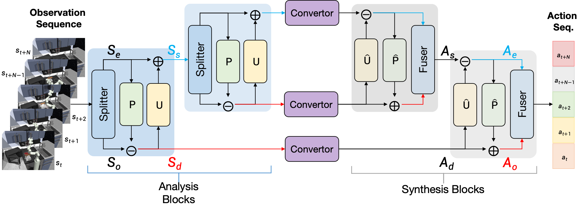

# Wavelet Policy: Lifting Scheme for Policy Learning in Long-Horizon Tasks

[](https://arxiv.org/abs/2507.04331) [](https://openaccess.thecvf.com/content/ICCV2025/papers/Huang_Wavelet_Policy_Lifting_Scheme_for_Policy_Learning_in_Long-Horizon_Tasks_ICCV_2025_paper.pdf) [](https://hhuang-code.github.io/wavelet_policy/) [](LICENSE)

This is the official repository of [Wavelet Policy: Lifting Scheme for Policy Learning in Long-Horizon Tasks]([https://arxiv.org/pdf/2507.04331](https://openaccess.thecvf.com/content/ICCV2025/papers/Huang_Wavelet_Policy_Lifting_Scheme_for_Policy_Learning_in_Long-Horizon_Tasks_ICCV_2025_paper.pdf)).

<div align=center>

</div>

## Environment setup
- Python 3.9+
- PyTorch 1.13.0
- Cuda 11.7

Or install dependencies with conda:
```bash
conda env create -f wavelet_policy.yaml
```
```angular2html
# NOTE: The versions of the dependencies listed above are only for reference. 
If you encounter any errors during the installation through .yaml, you can install manually with 'pip install ...'
```

## Kitchen and CARLA experiments
```angular2html
cd kitchen_carla
# Follow the README.md in that folder.
```

## PushT and Transport experiments
```angular2html
cd pusht_transport
# Follow the README.md in that folder.
```

## D3IL experiments
```angular2html
cd d3il
# Follow the README.md in that folder.
```

## Acknowledgements
Our code is built upon the repositories: [bet](https://github.com/notmahi/bet), [diffusion_policy](https://github.com/real-stanford/diffusion_policy),
and [d3il](https://github.com/ALRhub/d3il).
We would appreciate the authors for their great work.

## Citation
```angular2html
If you found this repository is helpful, please cite:

@inproceedings{huang2025wavelet,
  title={Wavelet Policy: Lifting Scheme for Policy Learning in Long-Horizon Tasks},
  author={Huang, Hao and Yuan, Shuaihang and Bethala, Geeta Chandra Raju and Wen, Congcong and Tzes, Anthony and Fang, Yi},
  booktitle={Proceedings of the IEEE/CVF International Conference on Computer Vision},
  pages={12349--12359},
  year={2025}
}
```
